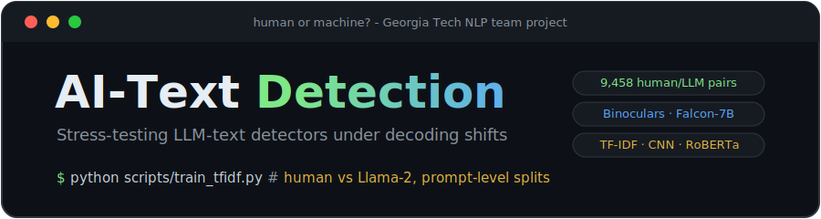
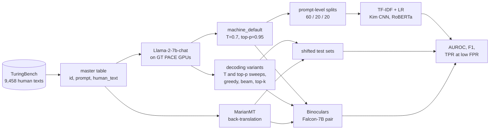

<div align="center">



[](https://www.python.org/)
[](https://pytorch.org/)
[](https://arxiv.org/abs/2109.13296)
[](LICENSE)

**Can AI-text detectors survive a change of decoding knobs or a paraphrase attack? This project pits Binoculars (zero-shot, cross-perplexity) against supervised detectors (TF-IDF + LR, Kim CNN, RoBERTa) on matched human/LLM text pairs, then shifts the generation distribution and watches what breaks.**

Georgia Tech graduate NLP team project.

</div>

---

## The idea

Supervised detectors look unbeatable when the machine text at test time comes from the same generator settings they trained on. The interesting question is what happens under distribution shift:

- **Decoding shifts:** temperature sweeps (0.1 to 1.5), top-p sweeps (0.8 to 0.99), greedy, beam search, top-k
- **Paraphrase attacks:** back-translation through German (MarianMT), applied to the machine side only (an evasion attack) or to both sides
- **Held-out generators:** machine text from models never seen in training

Every experiment reads from one **master table**: 9,458 human texts from TuringBench, each paired with a Llama-2-7b-chat continuation of the same 50-token prompt. Splits are made at the **prompt level**, so a prompt and all of its variants live in exactly one of train/val/test and nothing leaks.

## Pipeline



The base dataset (`data/master_table.jsonl`, all 9,458 human/machine pairs) is **bundled in this repo**, so the supervised baselines run out of the box on a laptop CPU. Only variant generation and Binoculars scoring need a GPU.

## Quick start

```bash
git clone https://github.com/abhi25072002/NLP-Project.git
cd NLP-Project
python3 -m venv venv && source venv/bin/activate
pip install -r requirements.txt

# 1. Build train/val/test splits from the bundled master table (seconds)
python scripts/create_supervised_datasets.py

# 2. Train and evaluate the TF-IDF + LR baseline (about 15 s on CPU)
python scripts/train_tfidf.py
python scripts/eval_tfidf.py --model_path checkpoints/tfidf_lr/model.joblib --data_dir data/supervised/base

# 3. Train and evaluate the Kim CNN (about 10 min on CPU)
python scripts/train_cnn.py
python scripts/eval_cnn.py --model_path checkpoints/cnn/best_model.pt --data_dir data/supervised/base

# RoBERTa fine-tuning (GPU recommended)
python scripts/train_roberta.py
```

In-distribution numbers from running exactly those commands on the bundled data (human vs `machine_default`, held-out test prompts):

| Model | Accuracy | F1 | AUROC |
|---|---|---|---|
| TF-IDF (word + char n-grams) + LR | 0.9974 | 0.9974 | 0.99997 |
| Kim CNN | 0.9929 | 0.9929 | 0.9997 |

Near-perfect, as expected in-distribution. The point of the project is that these numbers are the *ceiling*: the shifted test sets (`data/supervised/knobs/`, `data/supervised/backtrans/`) exist to measure how far each detector falls from it, and how Binoculars, which never trains at all, compares.

## Binoculars scoring

Zero-shot detection with the [Binoculars](https://arxiv.org/abs/2401.12070) method: score = observer perplexity / cross-perplexity, computed with the Falcon-7B / Falcon-7B-Instruct pair. The runner evaluates every `machine_*` column of the master table against the human side:

```bash
python run_zero_shot_master_table.py \
  --data_path data/master_table.jsonl \
  --output_path results/full_standard.csv
```

`--compute_token_metrics` adds KL and Jensen-Shannon divergence per token; `merge_results.py` aggregates multiple runs into a single Markdown report. See [EXPERIMENTS.md](EXPERIMENTS.md) for all scenarios, flags, and output formats.

## Rebuilding the dataset (GPU)

The bundled master table was generated on Georgia Tech's PACE cluster. To regenerate or extend it:

```bash
# Requires a HuggingFace token with access to meta-llama/Llama-2-7b-hf
python scripts/prepare_local_turingbench.py     # consolidate TuringBench human texts
python scripts/generate_default_dataset.py      # 9,458 baseline continuations
python scripts/generate_variants.py --mode all  # temperature/top-p/decoding variants
python scripts/backtranslate.py                 # MarianMT paraphrase attack sets
python scripts/create_supervised_datasets.py    # final train/val/test JSONL files
```

On a single PACE GPU, one decoding variant over a 148-prompt subset takes about 38 minutes; the full 9,458-prompt baseline is an overnight job.

<details>
<summary><b>PACE / HPC environment notes</b> (cache paths, gated models)</summary>

```bash
# Point HuggingFace caches at scratch to avoid home-dir quota errors
export HF_HOME=~/scratch/NLP-Project/hf/hf_home
export TRANSFORMERS_CACHE=~/scratch/NLP-Project/hf/hf_cache
export HF_DATASETS_CACHE=~/scratch/NLP-Project/hf/data_cache
export XDG_CACHE_HOME=~/scratch/NLP-Project/hf/hf_cache
mkdir -p $HF_HOME $TRANSFORMERS_CACHE $HF_DATASETS_CACHE $XDG_CACHE_HOME

# Llama-2 is gated: accept the license on its model page, then
export HF_TOKEN="your_hf_token_here"   # or: huggingface-cli login
```

</details>

## Repository structure

```
NLP-Project/
├── data/
│   ├── master_table.jsonl         # 9,458 human/Llama-2 pairs (bundled)
│   └── human_turingbench.csv      # consolidated TuringBench human texts
├── configs/                       # generation, model, eval, data YAMLs
├── scripts/
│   ├── generate_default_dataset.py, generate_variants.py, backtranslate.py
│   ├── create_supervised_datasets.py
│   └── train_/eval_ x {tfidf, cnn, roberta}
├── src/
│   ├── binoculars/                # detector, PPL/X-PPL/KL/JSD metrics
│   ├── models/                    # TF-IDF+LR, Kim CNN, RoBERTa
│   ├── generation/                # Llama-2 variant generator, MarianMT back-translation
│   └── data/                      # master-table builder, prompt-level splitter
├── run_zero_shot_master_table.py  # Binoculars runner (all machine_* columns)
├── merge_results.py               # aggregate runs into one report
└── EXPERIMENTS.md                 # Binoculars experiment cookbook
```

Full generated artifacts (variant datasets, checkpoints) live on Drive: [datasets](https://drive.google.com/drive/folders/1WG-BQv0x6NWoePe6YDeqECrrThxDVMSx?usp=sharing) · [checkpoints](https://drive.google.com/file/d/1HQ6SmPyjBkdzIhFBgwljxRATO5axjpZZ/view?usp=sharing).

## Team

- [Abhishek Dharmadhikari](https://github.com/abhi25072002)
- Neel Shah
- Vishrut Goel
- Aditya Pandit

## References

- Hans et al., [Spotting LLMs with Binoculars: Zero-Shot Detection of Machine-Generated Text](https://arxiv.org/abs/2401.12070) (ICML 2024)
- Uchendu et al., [TuringBench: A Benchmark Environment for Turing Test in the Age of Neural Text Generation](https://arxiv.org/abs/2109.13296) (EMNLP Findings 2021)

## License

[MIT](LICENSE)
